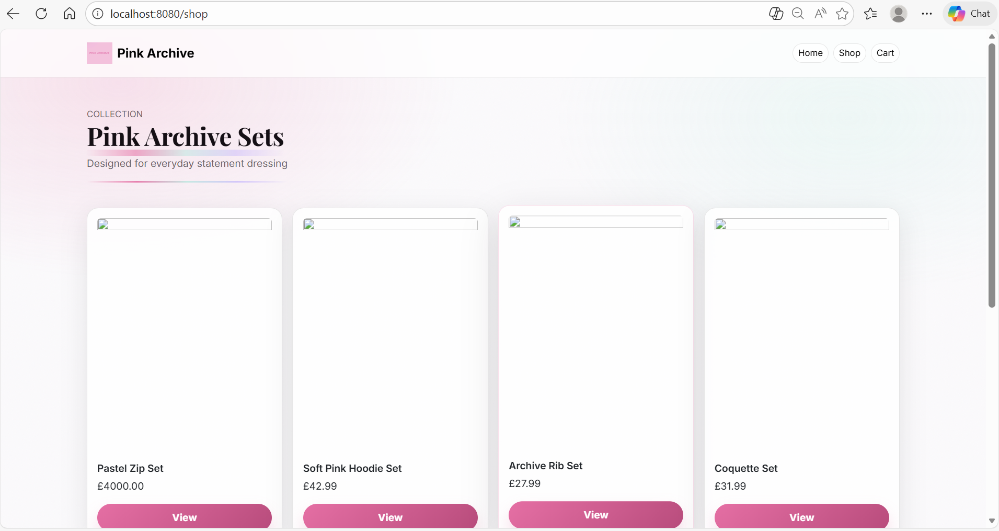
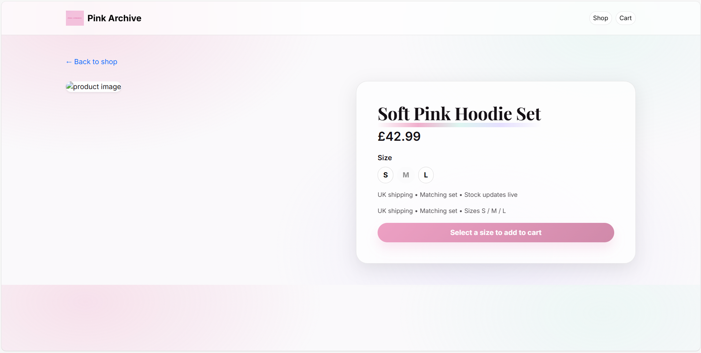
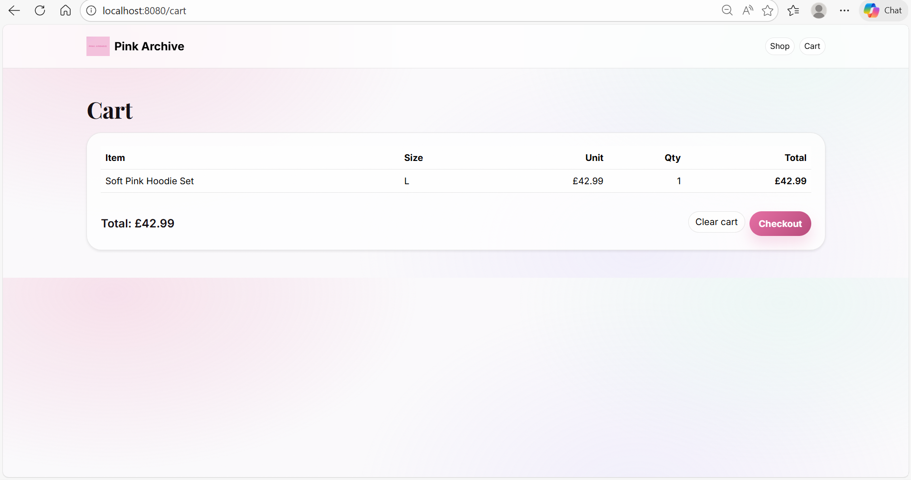
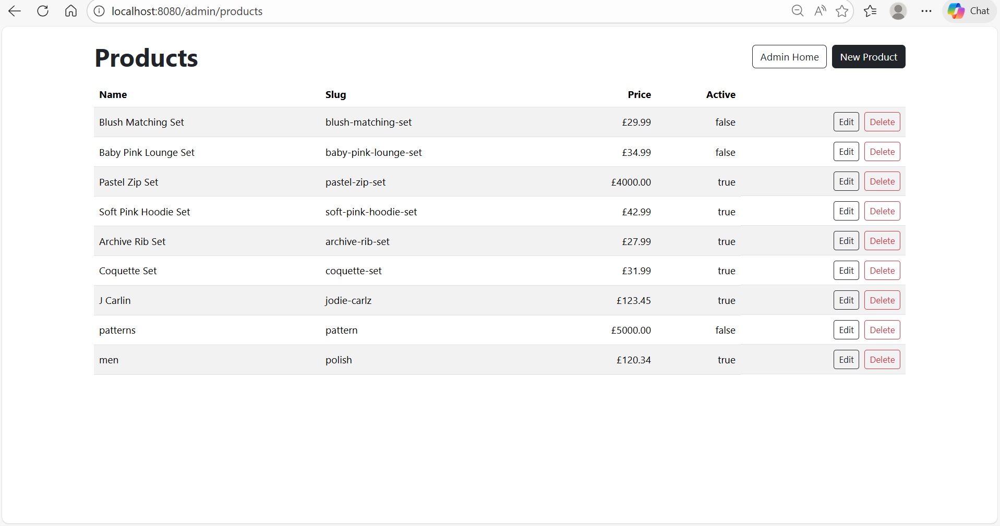

# Pink Archive

Pink Archive is a full-stack e-commerce platform built with **Spring Boot, Stripe Checkout, and MySQL**.  
The system provides secure payment processing, product inventory management, and an admin dashboard for managing products and orders.

The project was developed to demonstrate backend architecture, secure payment integrations, and real-world e-commerce workflows using modern Java frameworks.

## Screenshots

### Shop Page


### Product Page


### Cart


### Admin Dashboard


---

# Features

- Stripe Checkout integration
- Secure webhook payment verification
- Product inventory management with size variants (S/M/L)
- Admin dashboard for product and order management
- Order history with CSV export
- Session-based shopping cart
- Secure authentication with Spring Security

---

# Planned Features

The following features are planned before full production deployment:

- Product search
- Customer accounts
- Order history for users
- Email order confirmation
- Pagination for admin orders
- Product reviews
- Mobile application

---

# Tech Stack

**Backend**
- Java 17
- Spring Boot
- Spring Security
- Spring Data JPA
- Stripe API

**Frontend**
- Thymeleaf
- Bootstrap

**Database**
- MySQL

**Build Tools**
- Gradle

```
# Architecture:
Client (Browser)
        │
        │ HTTP Requests
        ▼
Spring Boot Application
        │
        ├── Controllers
        │      ShopController
        │      CheckoutController
        │      StripeWebhookController
        │      AdminController
        │
        ├── Services / Business Logic
        │      Cart (session model)
        │      Stripe payment flow
        │
        ├── Persistence Layer
        │      JPA Repositories
        │
        ▼
MySQL Database
        │
        ├── products
        ├── variants
        ├── orders
        └── order_items
```

The application follows a **layered architecture** where:

- HTTP requests are handled by **Spring MVC controllers**
- Business logic is managed within the application layer
- Data persistence is handled via **Spring Data JPA repositories**
- Data is stored in a **MySQL relational database**


```
# Database Schema

Product
 ├── id
 ├── name
 ├── slug
 ├── price
 └── imageUrl
        │
        │ 1
        │
        ▼
Variant
 ├── id
 ├── size (S/M/L)
 ├── stock
 └── product_id

Order
 ├── id
 ├── status
 ├── stripe_session_id
 ├── total_pence
 ├── created_at
 └── paid_at
        │
        │ 1
        │
        ▼
OrderItem
 ├── id
 ├── product_slug
 ├── product_name
 ├── size
 ├── unit_price_pence
 ├── quantity
 └── order_id
```

- **Product** stores the main product information.
- Each product has multiple **Variants** representing different sizes and stock levels.
- When a purchase occurs, an **Order** record is created.
- Each order contains **OrderItems** representing the individual products purchased.

---
```
# Payment Flow

Customer
   │
   ▼
Add Product to Cart
   │
   ▼
CheckoutController
   │
   ▼
Stripe Checkout Session Created
   │
   ▼
Customer Pays on Stripe
   │
   ▼
Stripe Webhook (checkout.session.completed)
   │
   ▼
StripeWebhookController
   │
   ├── Mark order PAID
   └── Decrement inventory
```

The checkout flow works as follows:

1. A customer adds products to their shopping cart.
2. The `CheckoutController` creates a Stripe Checkout session.
3. The customer completes payment securely through Stripe.
4. Stripe sends a webhook event (`checkout.session.completed`).
5. The `StripeWebhookController` verifies the webhook, marks the order as **PAID**, and updates inventory.

---

# Running the Project Locally

1. Clone the repository
2. Create a MySQL database (Create DATABASE pink_archive)
3. Configure the database in `application.properties`
4. Run the application
From IntelliJ or using Gradle: ./gradle bootRun
5. Open the application (http://localhost:8080)


---

# License

This project is currently under development. 


